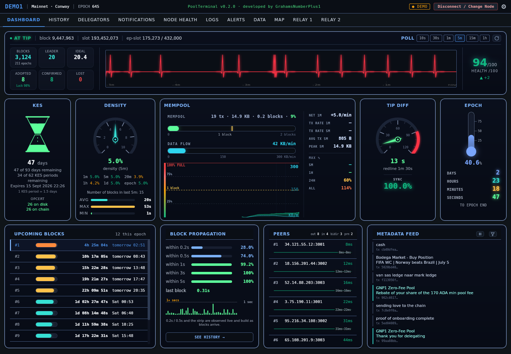

# PoolTerminal

**A Bloomberg-terminal-style desktop dashboard for Cardano stake pool operators.**

Dense. Real-time. Read-only. Packed with data nothing else surfaces.

---

> **v0.1.0 is available.** [Download the latest release](https://github.com/GNP1-dev/PoolTerminal/releases/latest) · Linux (AppImage / .deb). Active development - star to follow progress.

> _Last updated: 17 July 2026_ <!-- readme-beta-v2 -->

> ### ⚠️ This is a beta. I need your help testing it.
>
> PoolTerminal runs every day against a live block producer, but it is **early software and I do not expect it to be working 100% yet**. There will be bugs, rough edges and things I haven't hit on my own setup.
>
> **That's where you come in.** Every pool is configured differently - different distros, node layouts, db-sync setups, pool sizes. If you're an SPO, the most useful thing you can do is **run it, try to break it, and tell me what went wrong.**
>
> 🐛 **[Report a bug or tell me what broke](https://github.com/GNP1-dev/PoolTerminal/issues)** - include what you were doing, your setup (distro, node, data source), and any error text. Rough reports are fine; I'd rather hear it than not.
>
> It is **read-only** - it cannot sign, spend, or change anything on your node - so the worst a bug can do is show you something wrong or fail to load. Your pool is never at risk from it.



_The DASHBOARD view: chain pulse, KES, mempool flow, block propagation, upcoming leader slots and a live chain metadata feed. (Node address and peer IPs redacted.)_

## What it is

PoolTerminal is a desktop application for SPOs running their own Cardano block producer. It connects to your node - over SSH, or directly when run on the node itself - and presents a rich, real-time operational dashboard that goes far beyond what gLiveView or generic chain explorers offer.

It is **read-only by design** - no transaction signing, no key access, no node control from the GUI. Your keys never leave your node. PoolTerminal observes and reports; it does not act. It runs on your own machine and stores nothing on anyone else's servers.

## Why

Running a Cardano stake pool produces a torrent of operational data that's locked away in log files, sqlite databases, Prometheus endpoints, cardano-cli outputs and external APIs. Existing tools surface a fraction of it. PoolTerminal pulls it all together in one place, visualises it properly, and stores history locally so you can see trends over weeks and months - not just snapshots.

## Features

Working today:

- **DASHBOARD** - Live current-epoch view: chain pulse, tip/sync, KES expiry shown as an **hourglass** whose sand drains as the key ages (volume-correct to the glass shape, colour-warning as expiry nears, with exact days-and-periods remaining and the on-disk vs on-chain **operational certificate counter** and health check), ideal/leader, era badge, an intelligent **mempool** panel (fill shown against the one-block clearing limit with a "max block size reached" alert, plus a live **data-flow rate** in KB/min that reveals real transaction demand independent of block timing, traced in a second line on the mempool graph), **block propagation** timings down to sub-second buckets with a rolling per-block history strip, peer counts with a **per-peer latency trend** sparkline (auto-scaled to each peer's own range so single-millisecond drift is visible), and a compact relay map. The block-propagation strip is scaled to the sub-second range with a 1-second reference line so normal variance is readable, and a **See history** button jumps to the full propagation record. **Upcoming blocks** lists your assigned leader slots for the current *and* next epoch (once the ~36 h leadership-schedule window opens) as horizontal rows, next-to-mint first and scrollable, each with a progress bar that fills and warms toward red as the slot nears, a live d:h:m:s countdown, the day/time and slot number - sourced from the authoritative `cardano-cli` leadership schedule and cached per epoch. A live **Metadata feed** streams CIP-20 transaction messages from across the chain as blocks arrive - the actual notes people attach to their transactions - buffered and released at a steady pace so it reads as a continuous ticker; a funnel menu filters out DEX/bot spam, betting markets and profanity, with a pause control, scroll-back and per-message timestamps (needs db-sync). Views repaint instantly from cache on return, refreshing live behind.
- **HISTORY** - Full per-epoch table back to your pool's first epoch: blocks, ideal, luck, delegators, active stake, and a colour-coded six-way reward split (delegator reward · pledge · min-fee · margin · **SPO earnings** · total payout), where SPO earnings is the operator's own take per epoch. Charts for blocks-per-epoch and luck.
- **DELEGATORS** - One data-rich, sortable table of every delegator, merging live stake with a computed **loyalty** ranking (tenure × stake-weight × penalties for defection/withdrawal). Sort by loyalty or stake, dust filter, paginated. **Search by stake address** to jump straight to a delegator and highlight their row, and **copy** any full stake address with one click. Click any delegator for a deep-dive: balance, rewards, withdrawals, DRep flag, and a colourful **pool-movement journey** showing every pool they've delegated to with entry/exit epochs and active stake at each. Each row has two history buttons: **Delegation history** (the pool-movement journey) and **Stake history** - a per-epoch active-stake table (balance, change, running balance going back in time) paired with a running-balance line graph across the delegator's whole history. Stake history works from db-sync, Koios *or* Blockfrost; on db-sync it additionally shows intra-epoch movements (rewards in, withdrawals out). The deep-dive works from db-sync, Koios *or* Blockfrost; the loyalty leaderboard needs db-sync or Blockfrost (Koios can't compute it).
- **NODE HEALTH** - Host and node-process metrics (CPU, memory, peers, resources) with historical samples.
- **LOGS** - A read-only diagnostics workspace over your node's systemd journal and CNCLI data - no shell, no writes, every query bounded and run at low CPU/IO priority so it can never compete with block production. Curated one-click queries surface what matters: errors & warnings, recent meaningful activity (filtering out routine per-slot churn), KES status, restarts, rollbacks, and upcoming leader slots. **Blocks minted** shows your forged-block history from two switchable sources - the local **CNCLI blocklog** (recent blocks with confirmed / ghosted / stolen status) or **db-sync** (the complete lifetime record of every block your pool has ever forged) - as a rich colour-coded table. **Propagation history** persists every block's propagation delay to a local cache and surfaces the slowest blocks for review, with a trend sparkline and summary stats (median, p95, worst, counts over 1s/2s/5s) - so a rare slow block is caught and kept long after it scrolls off the live dashboard strip. Each slow block carries its **height** and, where db-sync is configured, the **producing pool** (ticker + pool id, resolved by height from db-sync's own off-chain metadata) so you can see *which* pool forged a block that reached your node late. The slow-block table scrolls within a fixed region while the chart and stats stay pinned, so it never runs off-screen as the log grows. A **time-window selector** (1h / 6h / 12h / 24h / 7d / All) keeps the sparkline granular as history builds, recomputing the stats over the chosen window; each delay is recorded once per block (deduplicated on block number) so a held metric during a quiet spell can never log phantom blocks. **Epoch transition** takes the same per-block record and renders the run-up to an epoch or hard-fork boundary as a stem chart - each block coloured by delay, any gap of two minutes or more between captured blocks shaded and labelled, and the first, often-late block after a production gap marked - turning a boundary event into something you can actually see rather than a blank stretch on a strip. A ~30s liveness beat, persisted alongside the delays, lets the view tell two very different gaps apart: an **amber production gap** (beats ran right through it, so the chain itself produced nothing - the fork-boundary case) versus a **grey "PoolTerminal offline" band** (no beats, so the app was simply down while the chain kept producing - not a chain event at all). Gap labels pack into stacked lanes so they never overlap even at the 12h / 24h / 7d windows.
- **NOTIFICATIONS** - A live feed of delegation activity, detected on-chain within minutes: delegators joining (with the pool they came from), transfers in, **returning** delegators (anyone who was ever delegated before), redelegations away, and stake increases/decreases. Each event is colour-coded with a from→to flow, amount, epoch, slot, UTC timestamp and a one-click Cardanoscan transaction link. Each event's stake address can be **copied** with one click (handy for pasting into the Delegators search). When a returning delegator's true prior pool can't be resolved from the active source (e.g. a same-epoch multi-hop that epoch-grained APIs can't see), the event is honestly labelled **Returning Former Delegator** with the origin shown as unknown and a hint that db-sync resolves the full transfer chain. A **Clear history** button wipes the displayed feed while leaving monitoring intact. Corner toasts surface activity from any tab, and an unread badge tracks new events. A built-in advisor scales the polling cadence to your delegator count and chosen source so notifications stay within free-tier limits. Systemic shifts that would otherwise flood the feed - the whole stake distribution moving at an epoch boundary, a data-source switch changing the stake basis, or any mass change across many delegators at once - are detected and absorbed silently, so only genuine per-delegator activity surfaces.
- **DATA** - A transparency screen showing exactly which source is answering each feature (node, db-sync, Koios or Blockfrost), including the Logs tab's journal, CNCLI blocklog and propagation-history sources, and what each optional source would unlock.
- **MAP** - Full-size D3 world map (Natural Earth, cached offline after first load) plotting your node and its live peers, geo-located, with RTT-coloured connections and a side panel of latency bands and geographic distribution.
- **RELAY 1 / RELAY 2** - Dedicated live dashboards for your relays, each monitored independently and in full isolation from the block producer and from each other (a relay stalling flatlines only its own heartbeat; the others are unaffected). Every reading comes straight from that relay's own cardano-node, Prometheus-only, over its own SSH session (or locally) - no Koios, db-sync, Blockfrost or cache. Each tab carries a red heartbeat, density (with a one-hour settle countdown, since relays do not backfill historical blocks), mempool, tip diff with a true sync reading (100% through normal inter-block gaps, falling only when genuinely behind), an epoch countdown, block propagation, a scrollable per-peer list (IP · RTT · country, sorted fastest first) and a geolocated relay map centred on that relay's own location. When a host runs a co-located block producer and relay (e.g. a dual-NIC box with the BP in `cnode_bp` and the relay in `cnode_relay`), a node selector picks the relay automatically (preferring the node with no KES key) or by an explicit filter. Polling continues in the background while you work in other tabs, with a live connection timer, so returning to a relay is seamless with no gap in its data.
- **SETUP WIZARD** - A first-run guided walkthrough with a Koios-first flow: choose the free tier or enter an API key, connect to your node, then optionally add db-sync and/or Blockfrost, with notification cadence tuned automatically to your pool size and Koios tier. The db-sync step is a guided decision tree - is it on this machine, on your block producer, or on another machine - asking only for the fields each case needs, with inline info-icons that explain every requirement and hand you copy-paste setup commands, and a Test button that reports exactly which stage failed in plain words. For a remote db-sync it also handles the SSH key: point it at an existing key, have PoolTerminal **generate a dedicated key for you** on the spot, or take a step-by-step explained walkthrough - it then shows the public key and the exact commands to authorise it on the db-sync host, and carries the key path straight into the connection screen. Single-choice screens auto-advance and you can step back at any point before connecting. Re-runnable any time from Settings, or from a **Developer mode** panel that can force the wizard or reset everything for a clean run.
- **DEMO MODE** - Built-in synthetic pool data so you can try the full UI without connecting to a real node.

Planned next: **REWARDS** and **GOVERNANCE (DRep)** views.

## Data sources

PoolTerminal needs only **your node plus an internet connection** to be fully useful. Optional sources enrich it. It picks the best available source for each piece of data automatically.

- **Your node** (required) - all live data: chain tip, sync, KES, leader schedule, blocks, peers, mempool, host health. Read over SSH (or directly when run on the node).
- **Koios** (the baseline, free) - a public Cardano API needing only internet. Provides pool summary, delegator list, per-epoch history, live notifications, and the delegator deep-dive. This alone is a complete setup, and it's all most operators need.
- **db-sync** (optional) - read your own Cardano db-sync Postgres directly. Because it's your own data there are no API limits and history loads instantly: full per-epoch history, the delegator deep-dive and the **loyalty leaderboard**, straight from your own machine. db-sync can sit on the same machine, on your block producer, or on a separate box - PoolTerminal reaches a remote one by opening its own key-based SSH tunnel to it, so Postgres is never exposed to the network. It also powers the live chain **Metadata feed**.
- **Blockfrost** (optional) - a free project key that gives almost everything db-sync does without running a database: pool summary, delegator list and deep-dive, full per-epoch history, live notifications, and the **loyalty leaderboard**. A good middle ground for richer delegator features without db-sync.

When more than one source can answer, PoolTerminal prefers your own db-sync where you have it, then the public services. You can see exactly who serves what on the DATA tab, and there's a plain-language explanation under Settings → About.

### Capability matrix

| Capability | Node | Koios | db-sync | Blockfrost |
|---|:---:|:---:|:---:|:---:|
| Live node data (tip, KES, peers, mempool, blocks) | ✓ | | | |
| Epoch history, pool parameters | | ✓ | ✓ | ✓ |
| Pool summary (live/active stake, saturation, pledge) | | ✓ | | ✓ |
| Live notifications | | ✓ | | ✓ |
| Delegator list | | ✓ | ✓ | ✓ |
| Delegator deep-dive | | ✓ | ✓ | ✓ |
| Loyalty leaderboard | | | ✓ | ✓ |
| Chain metadata feed (live messages) | | | ✓ | |

Almost every capability has a Koios path, so a node-plus-internet setup is complete on its own - the one exception is the loyalty leaderboard, which needs db-sync or Blockfrost. Those two are add-ons that take over what they do best, with no API limits in db-sync's case.

## Connecting

**To your node:**

- **Remote node (SSH)** - connect to your BP or relay over SSH. Supports password, password + 2FA (keyboard-interactive), SSH key files (auto-detected or custom path, encrypted keys via passphrase), and ssh-agent.
- **This machine (local)** - run PoolTerminal *on* the node itself; it executes commands directly, no SSH needed.

**To db-sync (if used):** three modes, chosen in the setup wizard. **On this machine** - a local Unix socket. **On your block producer** - Postgres tunnelled over the node's existing SSH connection. **On another machine** - PoolTerminal opens its own dedicated SSH session to the db-sync host and reads Postgres over that tunnel; key-based auth bypasses any 2FA on the box, and database access is either a password or a loopback-trust line in `pg_hba.conf` (no password stored). Because the tunnel presents the connection to Postgres as loopback, the same setup works whether PoolTerminal runs on the node, a local machine, or a remote host - in any combination with where the block producer lives.

Relays have their own dedicated **Relay 1 / Relay 2** tabs (see Features) - purpose-built, node-only dashboards that read solely from each relay's own cardano-node and stay fully isolated from the block-producer view and from each other. They connect with the same options as above (local or SSH, every auth method), plus an optional node selector for hosts that run a co-located block producer and relay. You can also still point the main block-producer views at a relay, where block-producer-only panels (KES, ideal, leader, upcoming blocks) are clearly marked and skipped.

## Requirements

- Linux desktop (Ubuntu 22.04+, Debian 12+, Fedora 40+, or any modern distro with WebKitGTK 4.1)
- Access to your Cardano node - SSH to a remote node, or PoolTerminal running on the node
- A running Cardano node with the standard Guild Operators tooling layout
- An internet connection (for Koios, the built-in baseline source)
- (Optional) `cncli` on the node - some features unlock with cncli data
- (Optional) **db-sync** for the loyalty leaderboard and gap-free instant history
- (Optional) a **Blockfrost** project key as an alternative delegator-data source

## Platform support

**Linux** is the primary and fully supported platform - most SPOs run Linux desktops or have a Linux VM to hand.

**Windows and macOS builds are planned.** They will be shipped **unsigned**: PoolTerminal is a free, open-source hobby project for SPOs, not a commercial product, so it doesn't carry a code-signing certificate. Windows (SmartScreen) and macOS (Gatekeeper) will therefore warn that the developer is unidentified. That warning is expected - you can click through it, or, if you'd rather not trust a binary at all, build it yourself from source. The code is all here to audit.

## Installation

Download the latest build from **[Releases](https://github.com/GNP1-dev/PoolTerminal/releases/latest)**.

**AppImage** (recommended - any Linux distro, no install):

```bash
chmod +x PoolTerminal_0.1.0_amd64.AppImage
./PoolTerminal_0.1.0_amd64.AppImage
```

If it won't start, your system may be missing FUSE. Either install it
(`sudo apt install libfuse2` on Debian/Ubuntu) or run without it:

```bash
./PoolTerminal_0.1.0_amd64.AppImage --appimage-extract-and-run
```

**.deb** (Debian / Ubuntu):

```bash
sudo dpkg -i PoolTerminal_0.1.0_amd64.deb
```

On first run, the setup wizard walks you through connecting to your node.
You can also explore the whole interface with no node at all via **Demo mode**.

## Build from source

You need [Rust](https://rustup.rs/), [Node.js](https://nodejs.org/), and the
Tauri 2 Linux prerequisites (WebKitGTK 4.1 and friends - see the
[Tauri prerequisites guide](https://v2.tauri.app/start/prerequisites/)).

```bash
git clone https://github.com/GNP1-dev/PoolTerminal.git
cd PoolTerminal
npm install

# run in development
cargo tauri dev

# or build release bundles (AppImage + .deb into
# src-tauri/target/release/bundle/)
cargo tauri build
```

## Trust & security

PoolTerminal is open source, Apache 2.0 licensed. Audit before you trust it. Key trust properties:

- **Read-only.** No commands that modify state on your node are issued.
- **Keys never leave the node.** PoolTerminal does not transmit keys, mnemonics, or wallet files anywhere.
- **Secrets are never persisted.** SSH passwords, OTP codes, and key passphrases live only in memory for the session - never written to disk. (A db-sync password is only stored if you explicitly opt in during setup; the loopback-trust option stores no password at all.)
- **No telemetry.** PoolTerminal does not phone home. Network connections are: your node (SSH), your db-sync (if used), and read-only public APIs (Koios for pool stats, Blockfrost if you add a key, ip-api for peer geo-location). Nothing else.
- **Local cache only.** Historical data is stored in a SQLite database on your own machine.

## Tech stack

- **Tauri 2** (Rust + web frontend, native performance)
- **Vanilla JS** frontend (no framework)
- **D3 + Apache ECharts** for visualisations
- **russh** for async SSH; **tokio-postgres** for db-sync; **rusqlite** for the local cache

## Hard fork awareness

PoolTerminal is built with Cardano's regular hard fork cycle in mind. See `HARDFORK.md` for the running list of fork-sensitive code areas and the current upgrade target.

## Documentation

- `MANUAL.md` - operator's manual: setup, views, data sources, caching, troubleshooting.
- `DESIGN.md` - architecture and design notes.
- `HARDFORK.md` - fork-sensitive code and upgrade checklist.

## Status

**Beta - active development.** It works, and it's in daily use on a live pool. But it has only really been exercised on *one* operator's setup (mine), and every pool is different. Expect rough edges.

**Working:** the full data layer (node, Koios, db-sync, Blockfrost), connection (SSH + local), the setup wizard, and the DASHBOARD / HISTORY / DELEGATORS / NODE HEALTH / NOTIFICATIONS / DATA / MAP views - including per-delegator stake history, op-cert counter monitoring and honest returning-delegator labelling. Dedicated **Relay 1 / Relay 2** tabs work too: isolated, node-only relay dashboards with heartbeat, density, mempool, tip/sync, epoch, block propagation, a scrollable peer list, a geolocated relay map, background-persistent polling, and automatic node selection for co-located BP+relay hosts.

**Known rough edges:** the setup wizard is still being refined. Slow queries on a busy block producer (the leadership schedule especially) can take up to two minutes on first connect - that's the node, not the app, and it's signposted in the UI. Some things have only ever been tested against a single node layout.

**Next:** REWARDS and GOVERNANCE (DRep) views; Windows and macOS builds.

## Contributing

**The single most useful contribution right now is testing.** Run it against your own pool and tell me what breaks.

- 🐛 **[Open an issue](https://github.com/GNP1-dev/PoolTerminal/issues)** for anything that goes wrong - a crash, a wrong number, a confusing screen, a setup step that didn't work. Include your distro, node layout, and which data sources you're using.
- 💡 **Feature ideas and design feedback** are welcome too - this is built by one SPO, and other operators will want things I haven't thought of.
- 🔧 **Code contributions** are welcome. It's Apache 2.0; open an issue first if it's a big change so we don't duplicate work.

If you'd rather not run a binary, build it from source (above) - the whole point is that you can check it yourself.

## Licence

Apache 2.0 - see `LICENSE`.

## Author

Built by [GNP1-dev](https://github.com/GNP1-dev) - operator of the [GNP1 (GrahamsNumberPlus1)](https://grahamsnumberplus1.com/) Cardano stake pool.

If PoolTerminal helps you operate your pool better, the most generous thing you can do in return is delegate to a pool that donates to charity - GNP1 donates to mental health causes, but plenty of other charity pools exist too.
